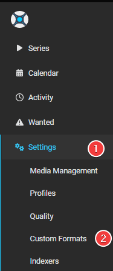
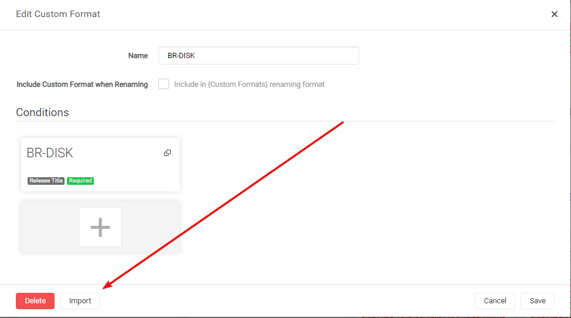
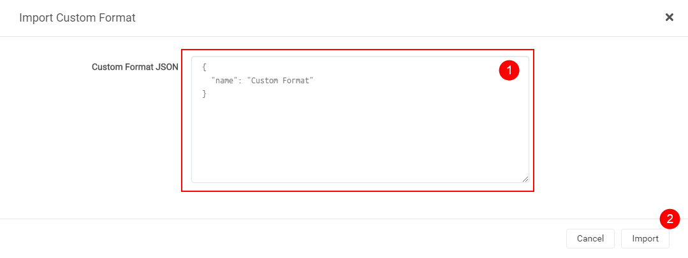
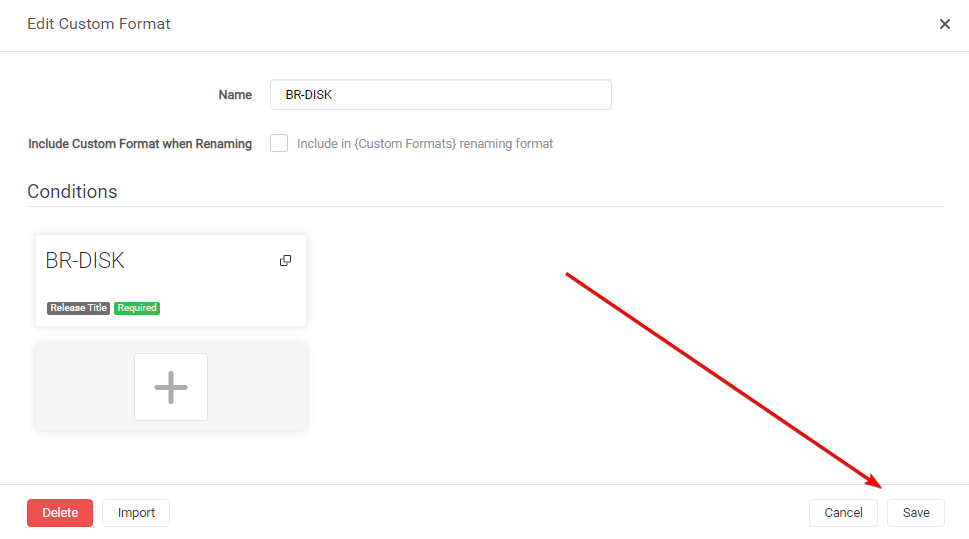

# How to update Custom Formats

Here I will try to explain how you can manually update Custom Formats for Sonarr v3+, With any changes from the guide or changes provided to you from other sources, without losing the scoring in your Quality Profile.

!!! info "Keep in mind Custom Formats are made to fine tune your Quality Profile. Generally, quality trumps all"

## How to Copy/Paste the JSON

The manual way is almost the same as the Import Custom Format way found [HERE](/Sonarr/sonarr-import-custom-formats/){:target="_blank" rel="noopener noreferrer"}

### In Sonarr

`Settings` => `Custom Formats`

### Open the Custom Format you want to update

### Paste the Custom Format

In the empty `Custom Format JSON` box (1) you just paste the `JSON` that you got from the [Custom Format Collection](/Sonarr/sonarr-collection-of-custom-formats/){:target="_blank" rel="noopener noreferrer"} or provided to you from other sources followed by the `Import` button (2).

### Save the Custom Format

After selecting the `Import` button you will get a screen that has all the Custom Format variables filled in correctly, all you need to do now is click on the `Save` button and you're done.

!!! warning "The Import to update existing Custom Formats replaces the existing Custom Format, so all manual changes you did to it will be lost :warning:"

### TRaSH Sync

This can be done also automatically with one of the TRaSH Sync Applications,

more info can be found [Here](/Guide-Sync/){:target="_blank" rel="noopener noreferrer"}

--8<-- "includes/support.md"
