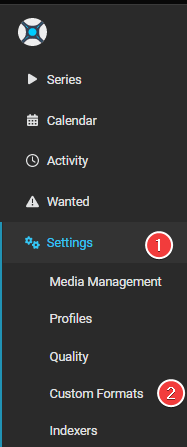

# How to import Custom Formats

Here I will try to explain how you can manually import Custom Formats for Sonarr v4+.

!!! info "Keep in mind Custom Formats are made to fine tune your Quality Profile. Generally, quality trumps all"

## How to Copy/Paste the JSON from the site

In this example I will use the [{{ sonarr['cf']['br-disk']['name'] }}](/Sonarr/sonarr-collection-of-custom-formats/#br-disk){:target="_blank" rel="noopener noreferrer"} Custom Format, the one most people don't want to download anyway. And if you do, then you probably don't use any of the Starr apps or Plex, being both don't support it.

Visit the [Collection of Custom Formats](/Sonarr/sonarr-collection-of-custom-formats/){:target="_blank" rel="noopener noreferrer"} and select [{{ sonarr['cf']['br-disk']['name'] }}](/Sonarr/sonarr-collection-of-custom-formats/#br-disk){:target="_blank" rel="noopener noreferrer"} from the table.

### Expand the JSON for BR-DISK

Then click the copy icon in the top right corner

## How to import a JSON Custom Format

### In Sonarr

`Settings` => `Custom Formats`

### Add a new Custom Format

Then click on the  to add a new Custom Format.

### Import the Custom Format

Followed by the `Import` in the lower left.

### Paste the Custom Format

Paste the `JSON` in the empty `Custom Format JSON` box (1) that you got from the [Custom Format Collection](/Sonarr/sonarr-collection-of-custom-formats/){:target="_blank" rel="noopener noreferrer"} followed by the `Import` button (2).

### Save the Custom Format

After selecting the `Import` button you will get a screen that has all the Custom Formats variables filled in correctly,
all you need to do now is click on the `Save` button and you're done.

### Setup the scores in your Quality Profile

After you've added the Custom Formats, You will need to set it up in the Quality Profile you want to use/prefer to make use of the Custom Formats.
How this is done is explained [HERE](/Sonarr/sonarr-setup-custom-formats/#basics){:target="_blank" rel="noopener noreferrer"}

------

## Start adding other Custom Formats wisely

!!! info ""

    Start adding more Custom Formats wisely, **Don't add all the available Custom Formats!!!**

    Check out the [How to setup Custom Formats](/Sonarr/sonarr-setup-custom-formats/) where I will explain how to make the most use of custom formats and show some personal examples that I'm using. You can use these examples to get an idea on how to setup yours.

### TRaSH Sync

This can be done also automatically with one of the TRaSH Sync Applications,

more info can be found [Here](/Guide-Sync/){:target="_blank" rel="noopener noreferrer"}

--8<-- "includes/support.md"
