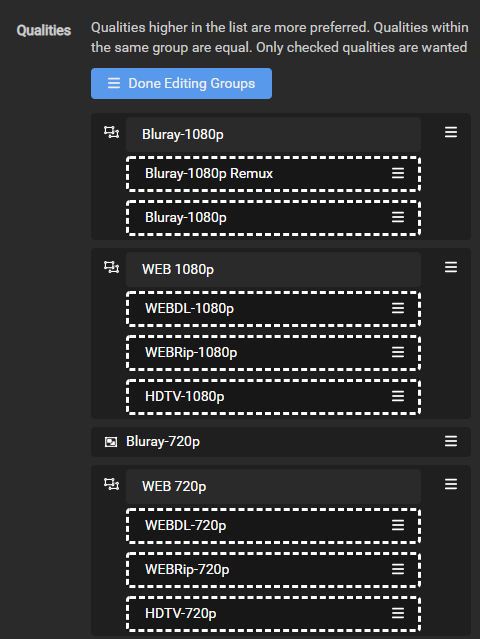
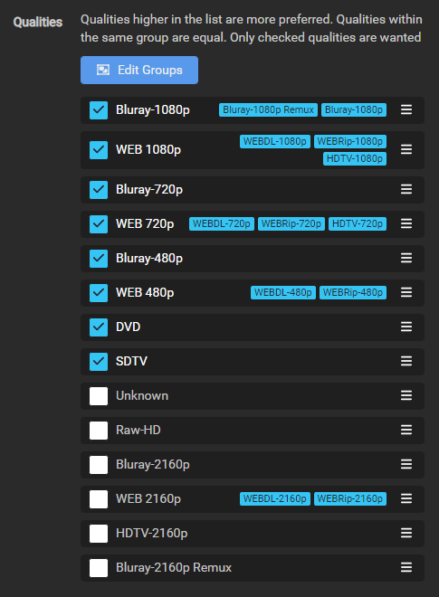
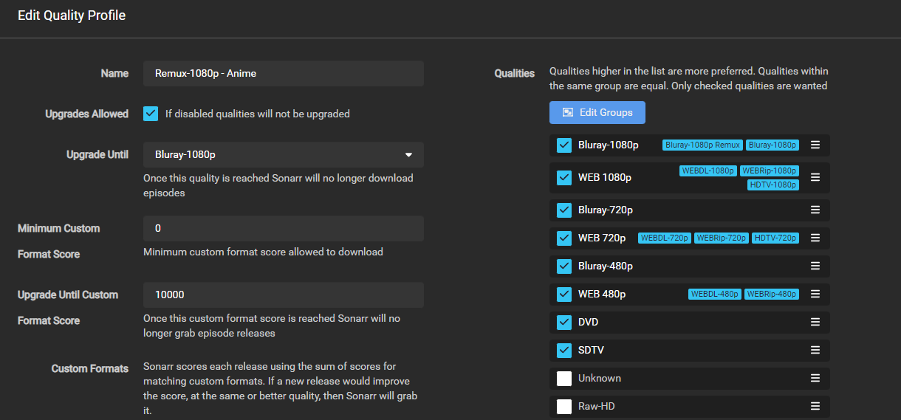

# How to setup Custom Formats (Anime)

!!! attention
    You must be running Sonarr V4 to be able to use this setup


!!! note
    This guide is created and maintained by [FonduemangVI](https://github.com/FonduemangVI) and [rg9400](https://github.com/rg9400)

    It's recommended to run two Sonarr instances. One for Anime and one for normal TV shows, or you can make use of Quality Profiles and score different Custom Formats (CFs) as required.

The aim of this guide is to grab the best release overall (as per [SeaDex](https://sneedex.moe/){:target="_blank" rel="noopener noreferrer"}) and not necessarily just dual audio.
The vast majority of releases can be found on [Nyaa](https://nyaa.si/){:target="_blank" rel="noopener noreferrer"} or [AB](https://animebytes.tv/){:target="_blank" rel="noopener noreferrer"}

!!! note
    Nyaa is a public tracker while AB is an invite only tracker.

---

## Media Management

### Series Type

When adding a new series make sure you set the series type to Anime

??? check "example - [Click to Expand]"
    

### Recommended naming scheme

```bash
{Series TitleYear} - S{season:00}E{episode:00} - {absolute:000} - {Episode CleanTitle} [{Custom Formats }{Quality Full}]{[MediaInfo VideoDynamicRangeType]}[{MediaInfo VideoBitDepth}bit]{[MediaInfo VideoCodec]}[{Mediainfo AudioCodec} { Mediainfo AudioChannels}]{MediaInfo AudioLanguages}{-Release Group}
```

??? summary "Results: - [Click to Expand]"

    Single Episode:

    `The Series Title! (2010) - S01E01 - 001 - Episode Title 1 [Surround Sound x264 HDTV-720p v2][10bit][AVC][DTS 5.1][JA]-RlsGrp`

    Multi Episode:

    `The Series Title! (2010) - S01E01-E03 - 001-003 - Episode Title [Surround Sound x264 HDTV-720p v2][10bit][AVC][DTS 5.1][JA]-RlsGrp`

#### Series Folder Format

```bash
{Series TitleYear}
```

Result:

`The Series Title! (2010)`

#### Season Folder Format

```bash
Season {season:00}
```

Result:

`Season 01`

#### Multi-Episode Style

```bash
Prefixed Range
```

Result:


---

## Quality Settings

For quality settings please refer to [Sonarr Quality Definitions - Anime](/Sonarr/Sonarr-Quality-Settings-File-Size/#sonarr-quality-definitions-anime){:target="_blank" rel="noopener noreferrer"}

---

## Quality Profile

We need to create a new profile called `Remux-1080p - Anime` due to the way anime can be named we will need to merge a few qualities together see [here](/Sonarr/Tips/Merge-quality/){:target="_blank" rel="noopener noreferrer"} for an example.

We need to add `Bluray-1080p Remux` and `Bluray-1080p` into a group together, and `HDTV-1080p` into the same group as `WEBDL-1080p` and `WEBRip-1080p` so that scoring will work correctly.

Go to `Settings` => `Profiles`

??? check "example - [Click to Expand]"
    



We then need to select and organise qualities as below.



Make sure `Upgrades Allowed` is ticked then set the `Upgrade Until` section to `Bluray-1080p` and the `Upgrade Until Custom Format Score` to `10000`

After this has been done your profile should look like below.



---

## Anime CF/Scoring

!!! note
    We're going to make use of the below custom formats. See [How to import Custom Formats](/Sonarr/sonarr-import-custom-formats/){:target="_blank" rel="noopener noreferrer"} for how to import them.

{! include-markdown "../../includes/cf/sonarr-anime.md" !}
<!-- --8<-- "includes/cf/sonarr-anime.md" -->

The scoring that has been set is the recommended scoring, however some of the CFs are optional depending on what you prefer.
`Anime Dual Audio`, `Uncensored` and `10bit` can be given postive scores if you want to prefer content with these attributes.

`Anime Raws` and `Dubs Only` are optional negative scores, if you prefer these attributes you can give them a positive score.

Once the custom formats have been imported you can set the scores as above. To do this go to `Settings` => `Profiles` and select the `Remux-1080p - Anime` profile that was setup before.

??? check "example - [Click to Expand]"
    

In the profile enter the scores as per the above table in this section.


After you are done it should look like the image above.

### Acknowledgements

Most of my information and knowledge came from:

- rg9400 (Building the Custom Formats, Guidance on anime groups and general knowledge share.)

- V01 from SeaDex (Guidance on anime groups and general knowledge share.)

- Drazzilb (Guidance on anime groups, testing and general knowledge share.)

- [TRaSH](https://trash-guides.info/) (For allowing me to utilize his website for our guide and general knowledge share.)

{! include-markdown "../../includes/support.md" !}
<!-- --8<-- "includes/support.md" -->