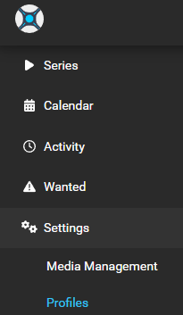
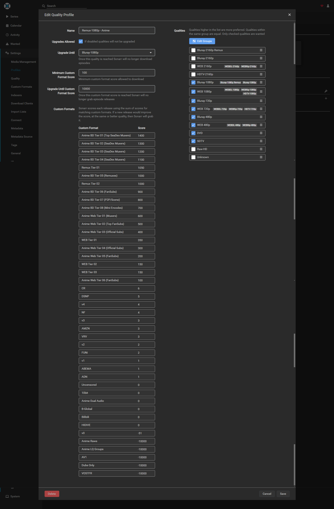

# How to setup Quality Profiles Anime

_aka How to set up Custom Formats (Anime)_<br><br>

!!! warning

    You must be running Sonarr V4 to be able to use this setup.

    { .off-glb }

!!! note

    This guide is created and maintained by [FonduemangVI](https://github.com/FonduemangVI) and [rg9400](https://github.com/rg9400)

It's recommended to run two Sonarr instances. One for Anime and one for normal TV shows, or you can make use of Quality Profiles and score different Custom Formats (CFs) as required.

This guide aims to grab the best release overall (as per [SeaDex](https://releases.moe/){:target="\_blank" rel="noopener noreferrer"}) and not necessarily just dual audio.
The vast majority of releases can be found on [Nyaa](https://nyaa.si/){:target="\_blank" rel="noopener noreferrer"} or [AB](https://animebytes.tv/){:target="\_blank" rel="noopener noreferrer"}

!!! info ""

    Nyaa is a public tracker while AB is an invite-only tracker.

---

## Media Management

### Series Type

When adding a new series make sure you set the series type to Anime

??? success "example - [Click to show/hide]"

    

### Recommended naming scheme

```bash
{{ sonarr['naming']['sonarr-naming']['episodes']['anime']['default'] }}
```

??? abstract "Results: - [Click to show/hide]"

    Single Episode:

    `The Series Title! (2010) - S01E01 - 001 - Episode Title 1 [Surround Sound x264 HDTV-720p v2][10bit][AVC][DTS 5.1][JA]-RlsGrp`

    Multi Episode:

    `The Series Title! (2010) - S01E01-E03 - 001-003 - Episode Title [Surround Sound x264 HDTV-720p v2][10bit][AVC][DTS 5.1][JA]-RlsGrp`

#### Series Folder Format

```bash
{{ sonarr['naming']['sonarr-naming']['series']['default'] }}
```

Result:

`The Series Title! (2010)`

#### Season Folder Format

```bash
Season {season:00}
```

Result:

`Season 01`

#### Multi-Episode Style

```bash
Prefixed Range
```

Result:


---

## Quality Settings

For quality settings please refer to [Sonarr Quality Definitions - Anime](/Sonarr/Sonarr-Quality-Settings-File-Size/#animeanimatedcartoons){:target="\_blank" rel="noopener noreferrer"}

If you are only running a single instance of Sonarr you can instead use [Sonarr Quality Definitions](/Sonarr/Sonarr-Quality-Settings-File-Size/#standard){:target="\_blank" rel="noopener noreferrer"}

---

## Quality Profile

We need to create a new profile called `Remux-1080p - Anime` due to the way anime can be named we will need to merge a few qualities - see [here](/Sonarr/Tips/Merge-quality/){:target="\_blank" rel="noopener noreferrer"} for an example.

We need to add `Bluray-1080p Remux` and `Bluray-1080p` into a group together, `HDTV-1080p` into the same group as `WEBDL-1080p` and `WEBRip-1080p`, and `HDTV-720p` into the same group as `WEBDL-720p` and `WEBRip-720p` so that the scoring will work correctly.

Go to `Settings` => `Profiles`




We then need to select and organize the qualities as seen below.


---

## Anime CF/Scoring

!!! note

    We're going to make use of the below custom formats. See [How to import Custom Formats](/Sonarr/sonarr-import-custom-formats/){:target="\_blank" rel="noopener noreferrer"} for how to import them.

### Default Scoring

{! include-markdown "../../includes/cf/sonarr-anime.md" !}

{! include-markdown "../../includes/cf/sonarr-streaming-services-anime.md" !}

The scoring that has been set is the recommended scoring, however, some of the CFs are optional depending on what you prefer.
`Anime Dual Audio`, `Uncensored` and `10bit` can be given positive scores if you want to prefer content with these attributes.

`Anime Raws` and `Dubs Only` are negatively scored, however, if you prefer these attributes you can give them a positive score.

Once the custom formats have been imported you can set the scores as above. To do this go to `Settings` => `Profiles` and select the `Remux-1080p - Anime` profile that was set up before.


In the profile enter the scores as per the above table in this section.


After you are done it should look similar to the image above, but using the current Guide Scores from the above tables.

### Dual Audio Scoring

If you prefer `Dual Audio` releases you have a few options depending on your preference.

If you want to prefer `Dual Audio` within the same tier give the `CF` a score of `10`, if you want it to be preferred a tier above give the `CF` a score of `101`, and if you want to prefer it over any tiers give the `CF` a score of `2000`.

If you must have `Dual Audio` releases set the `Minimum Custom Format Score` to 2000 in the `Remux-1080p - Anime` profile that you setup earlier.

Using this scoring you will still benefit from the tiers if a better release group does a `Dual Audio` release.

Below is an example of the scoring set to prefer `Dual Audio` over any tier.


### Uncensored Scoring

!!! note

    Most BDs are uncensored by default, so most groups do not include that in the name.

If you prefer `Uncensored` releases you have a few options depending on your preference.

If you want to prefer `Uncensored` within the same tier give the `CF` a score of `10`, if you want it to be preferred a tier above give the `CF` a score of `101`.

Using this scoring you will still benefit from the tiers if a better release group does an `Uncensored` release.

Below is an example of the scoring set to prefer `Uncensored` a tier above.


### Finishing up

Once you have set your preferred scoring you will need to make one more change to your `Remux-1080p - Anime` profile.

Make sure `Upgrades Allowed` is ticked then set the `Upgrade Until` section to `Bluray-1080p` and the `Upgrade Until Custom Format Score` to `10000`

After this has been done your profile should look as seen below. This is an example of the Default Scoring setup.



### Acknowledgements

Most of my information and knowledge came from:

- rg9400 (Building the Custom Formats, Guidance on anime groups and sharing general knowledge.)

- V01 from SeaDex (Guidance on anime groups and sharing general knowledge.)

- Drazzilb (Guidance on anime groups, testing and sharing general knowledge.)

- [TRaSH](https://trash-guides.info/) (For allowing me to utilize his website for our guide and sharing general knowledge.)

--8<-- "includes/support.md"
