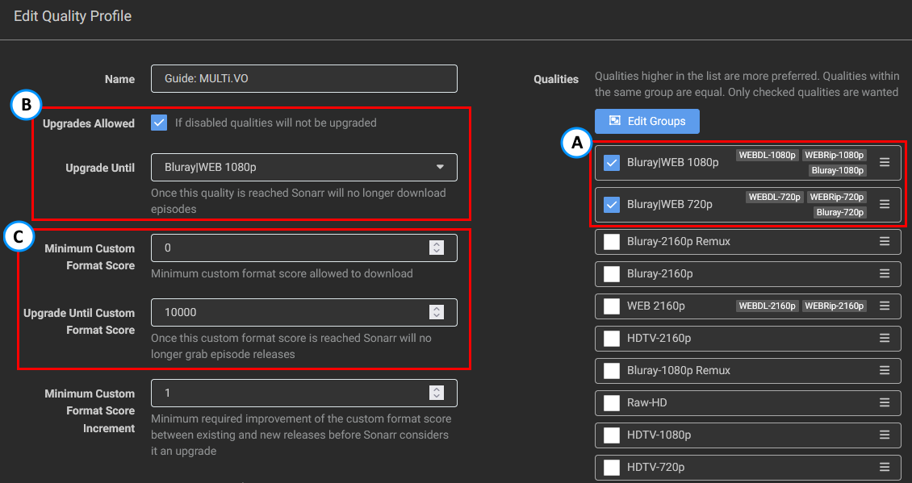
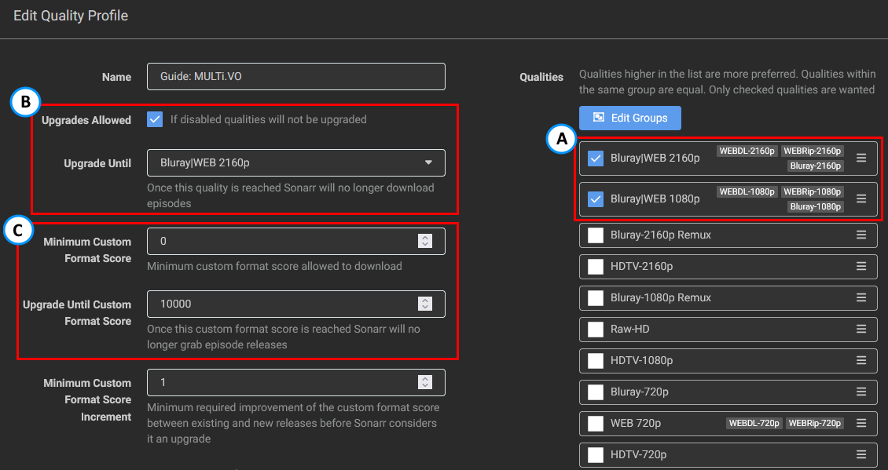

# How to set up Quality Profiles (French)

*aka How to Set Up Custom Formats to Get French Audio and/or Subs*  

!!! note "This guide is created and maintained by [Someone Said "Nice"?](https://github.com/NiceTSY)"

!!! tip "Cette page est aussi disponible en Français : [Guide en Français](/Sonarr/sonarr-setup-quality-profiles-french-fr/){:target="\_blank" rel="noopener noreferrer"}."

---

## Basics

It is quite important that you follow and understand what is envisioned by Trash's guide:

- Adding Custom Formats, as explained in [How to import Custom Formats](/Sonarr/sonarr-import-custom-formats/){:target="_blank" rel="noopener noreferrer"}.
- Setting up a quality Profile to make use of the Custom Formats, as explained in [How to setup Quality Profiles | Basics section](/Sonarr/sonarr-setup-quality-profiles/#basics){:target="_blank" rel="noopener noreferrer"}.

!!! warning "Please read those two sections before continuing the guide as they hold important information. The rest of this guide will assume you did."

!!! tip
    TRaSH created a [flowchart](/Sonarr/sonarr-setup-quality-profiles/#which-quality-profile-should-you-choose){:target="\_blank" rel="noopener noreferrer"} to make your decision easier. Remember that this chart does not include any of the following Custom Formats, and you will still need to read this guide to get MULTi releases.

---

## FAQ

!!! info "I am not French from France but from Canada, does the guide still work?"
    Yes, the guide does accommodate for all types of French: VFF, VFQ, and VFB (even though this one is quite rare). Just make sure you check the scoring of the [French Audio Versions](#french-audio-versions) section.

!!! info "I am only interested in getting French subs (VOSTFR)"
    Please follow the **Want Original with subs** (**VOSTFR**) profile.

!!! info "Can I get HDLight or 4KLight?"
    Probably not, this guide is not geared toward these specific types. If space is an issue for you, prefer Web-DL or 720p Blu-ray releases.

!!! info "What about anime?"
    An example of Anime is also provided at the end: [Anime](#anime).

!!! info "FlareSolverr?"
    Please refer to the [How to set up FlareSolverr](/Prowlarr/prowlarr-setup-flaresolverr/){:target="\_blank" rel="noopener noreferrer"} section.

---

## Prowlarr specific settings

!!! abstract "Indexers - Replace MULTi by another language in release name option"
    Prowlarr allows MULTi to be replaced by another language. This option is great in theory but will lead to false positives regarding the French audio CFs.
    Please prefer using the Sonarr-specific settings "Indexers - Multi Languages option" below.

!!! abstract "Indexers - Replace VOSTFR and SUBFRENCH with ENGLISH option"
    This option should not be used, mostly because you lose some information regarding the release.
    Moreover, `VOSTFR` does not mean that the audio is in `English` but rather it is the `Original` audio, meaning it could be `Spanish`, `Korean`, etc.

!!! abstract "Indexers - Replace VFQ with FRENCH"
    Same as for the MULTi option, this will lead to false positives regarding the French audio CFs. Keep it disabled.

??? success "Screenshot example - [Click to show/hide]"
    

---

## Sonarr specific settings

!!! abstract "Media Management - Episode Naming"
    Please have a look there: [Recommended naming scheme](/Sonarr/Sonarr-recommended-naming-scheme/){:target="_blank" rel="noopener noreferrer"}.

!!! abstract "Indexers - Multi Languages option"
    In Sonarr, you can tell that MULTi in an indexer means that a release possesses at least certain audio. For the purpose of this guide, you will select `Original` and `French`.
    This option should only be used for French indexers. Doing so in more "international" indexers can create false positives with the French Audio CFs.

    If you do not see the option, it is because you need to activate the "Advanced Options" of Sonarr.

    ??? success "Screenshot example - [Click to show/hide]"
        

---

## Score logic

{! include-markdown "../../includes/merge-quality/sonarrv4-current-logic.md" !}

---

## Quality Profiles

{! include-markdown "../../includes/french-guide/french-guide-language-profiles-en.md" !}

---

### French Audio Versions

{! include-markdown "../../includes/french-guide/french-guide-french-audio-information-en.md" !}

{! include-markdown "../../includes/french-guide/sonarr-french-audio-version-en.md" !}

---

### HD Bluray + WEB (1080p)

!!! tip "Basic Settings"
    Make sure you merge the Bluray and WEB qualities into one group under your Quality Profile's qualities. This is due to the fact that potential releases with `French` audio may not exist in WEB.
    For some older shows, you might want to enable the `HDTV-720p/1080p`, or even `DVD` quality sources. Depending on your preferences, you could also merge the `HDTV` with their related `Web|Bluray` group.

    ??? success "Profile Screenshot - [Click to show/hide]"
        

{! include-markdown "../../includes/starr/move-quality-to-top.md" !}

{! include-markdown "../../includes/cf/sonarr-suggest-attention.md" !}

**The following Custom Formats are required:**

{! include-markdown "../../includes/french-guide/sonarr-cf-french-web-scoring-en.md" !}

{! include-markdown "../../includes/french-guide/sonarr-french-unwanted-en.md" !}

{! include-markdown "../../includes/cf/sonarr-misc-required.md" !}

{! include-markdown "../../includes/cf/sonarr-streaming-services.md" !}

**The following Custom Formats are optional:**

{! include-markdown "../../includes/cf/sonarr-misc-optional.md" !}

{! include-markdown "../../includes/french-guide/sonarr-french-streaming-services-en.md" !}

Note: The `Advanced Audio` Custom Formats aren't used in the profile, as WEB-DL do not often come with HD audio (most newer WEB-DL will have lossy Atmos, though). If you want HD audio, we would suggest going with Remuxes.

---

### UHD Bluray + WEB (2160p)

!!! tip "Basic Settings"
    Make sure you merge the Bluray and WEB qualities into one group under your Quality Profile's qualities. This is due to the fact that potential releases with `French` audio may not exist in WEB.
    For some older shows, you might want to enable the `Bluray-720p/1080p`, `Web-720p/1080p`, `HDTV-720p/1080p/2160p`, or even `DVD` quality sources. Depending on your preferences, you could also merge the `HDTV` with their related `Web|Bluray` group.

    ??? success "Profile Screenshot - [Click to show/hide]"
        

{! include-markdown "../../includes/starr/move-quality-to-top.md" !}

{! include-markdown "../../includes/cf/sonarr-suggest-attention.md" !}

**The following Custom Formats are required:**

{! include-markdown "../../includes/french-guide/sonarr-cf-french-web-scoring-en.md" !}

{! include-markdown "../../includes/cf/sonarr-all-hdr-formats.md" !}

{! include-markdown "../../includes/french-guide/sonarr-french-unwanted-en.md" !}

{! include-markdown "../../includes/cf/sonarr-misc-required.md" !}

{! include-markdown "../../includes/cf/sonarr-uhd-streaming-services.md" !}

**The following Custom Formats are optional:**

{! include-markdown "../../includes/cf/sonarr-misc-optional.md" !}

{! include-markdown "../../includes/cf/sonarr-misc-uhd-optional.md" !}

{! include-markdown "../../includes/french-guide/sonarr-french-streaming-services-en.md" !}

Note: The `Advanced Audio` Custom Formats aren't used in the profile, as WEB-DL do not often come with HD audio (most newer WEB-DL will have lossy Atmos, though). If you want HD audio, we would suggest going with Remuxes.

---

### Anime

If you are looking to grab Anime with either French subs or MULTi audio (original + French).

{! include-markdown "../../includes/french-guide/sonarr-french-anime-info-en.md" !}

{! include-markdown "../../includes/cf/sonarr-anime-misc-required.md" !}

{! include-markdown "../../includes/french-guide/sonarr-french-unwanted-en.md" !}

{! include-markdown "../../includes/french-guide/sonarr-french-streaming-services-anime-en.md" !}

{! include-markdown "../../includes/french-guide/sonarr-cf-french-anime-scoring-en.md" !}

---

### HDR Formats

TRaSH provides great guides and explanations about them at the following links:

- [HDR Formats](/Sonarr/sonarr-setup-quality-profiles/#hdr-formats){:target="\_blank" rel="noopener noreferrer"}

---

## Other Infos

A FAQ regarding most of the questions you could have is provided by TRaSH: [FAQ & Info](/Sonarr/sonarr-setup-quality-profiles/#faq-info){:target="\_blank" rel="noopener noreferrer"}

---

## Acknowledgements

- A big thanks to all the people who helped me make and test those profiles and formats (and continue to do so).
- A special thanks to MySuperChef, PrL, and KoUiGnAmAnN for their time and explanations.
- A special thanks to SeiyaGame, TheFrenchNaruto, and Maxence who provided all of the Anime information.
- A special thanks to Piou and Wikoul who are potentially both now in asylums due to the amount of testing.
- [TRaSH](https://trash-guides.info/), for granting me a small space on his guide for this, his knowledge, and his friendliness.

--8<-- "includes/support.md"
