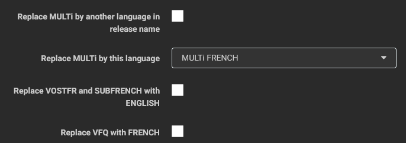
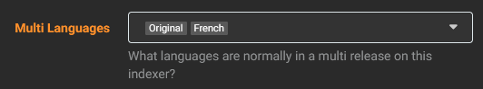
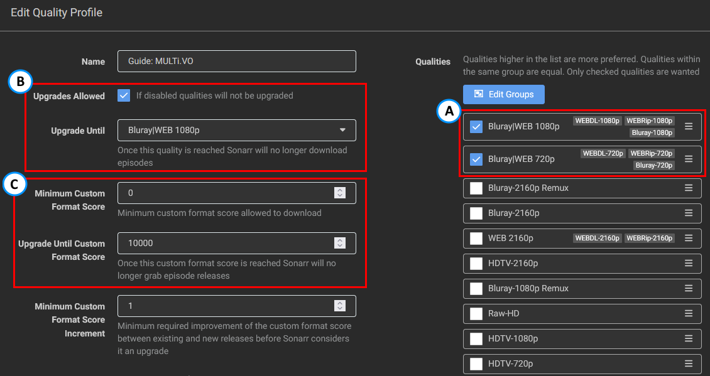
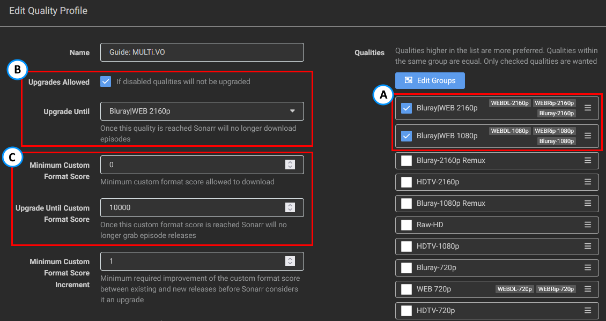

# Comment configurer ses Profiles (French Profile)

*aka Comment configurer les Formats Personnalisés pour obtenir un audio et/ou des sous-titres en français ?*  

!!! note "Ce guide a été créé et est maintenu par [Someone Said "Nice"?](https://github.com/NiceTSY)"

---

## Notions de base

Il est important que vous suiviez et compreniez ce qui est prévu par le guide de TRaSH :

- Ajouter des Formats Personnalisés, comme expliqué dans [How to import Custom Formats](/Sonarr/sonarr-import-custom-formats/){:target="_blank" rel="noopener noreferrer"} (anglais seulement).
- Configurer un Profil de Qualité pour utiliser les Formats Personnalisés, comme expliqué dans [How to setup Quality Profiles | Basics section](/Sonarr/sonarr-setup-quality-profiles/#basics){:target="_blank" rel="noopener noreferrer"}.

!!! warning "Veuillez lire ces deux sections avant de continuer le guide, car elles contiennent des informations importantes. Le reste de ce guide part du principe que vous l'avez fait."

!!! tip
    TRaSH a créé un [organigramme](/Sonarr/sonarr-setup-quality-profiles/#which-quality-profile-should-you-choose){:target="\_blank" rel="noopener noreferrer"} pour faciliter vos décisions. N'oubliez pas que ce schéma n'inclut aucun des formats personnalisés suivants et que vous devrez toujours lire ce guide pour obtenir des versions MULTi.

---

## FAQ

!!! info "Je ne suis pas Français de France mais du Canada, est-ce que le guide fonctionne toujours ?"
    Oui, le guide s'adapte à tous les types de français : VFF, VFQ et VFB (même si ce dernier est assez rare). Assurez-vous simplement de vérifier le scoring dans la section [Versions Audio Françaises](#versions-audio-francaises).

!!! info "Je suis seulement intéressé par les sous-titres français (VOSTFR)"
    Veuillez suivre le profil **Original avec sous-titres** (**VOSTFR**).

!!! info "Puis-je obtenir des HDLight ou 4KLight ?"
    Pas vraiment, ce guide n'est pas prévu pour cela. Toutefois, si l'espace disque est un problème pour vous, préférez les versions Web-DL ou les releases Blu-ray 720p.

!!! info "Qu'en est-il des animes ?"
    Un exemple de profil pour les animes est également proposé : [Anime](#anime).

!!! info "FlareSolverr ?"
    Il existe une section en anglais : [How to set up FlareSolverr](/Prowlarr/prowlarr-setup-flaresolverr/){:target="\_blank" rel="noopener noreferrer"}.

---

## Paramètres spécifiques à Prowlarr

!!! abstract "Indexers - Remplacer MULTi par une autre langue dans le nom de la release (Replace MULTi by another language in release name)"
    Prowlarr permet de remplacer MULTi par une autre langue. Cette option semble excellente mais entraînera des faux positifs concernant les CF audio français.
    Veuillez préférer l'utilisation de l'option "Indexeurs - Option Multi Langues" dans Sonarr (voir ci-dessous).

!!! abstract "Indexers - Remplacer VOSTFR et SUBFRENCH par ENGLISH (Replace VOSTFR and SUBFRENCH with ENGLISH)"
    Cette option ne devrait pas être utilisée, principalement parce que vous perdez des informations concernant la release.
    De plus, `VOSTFR` ne signifie pas que l'audio est en `Anglais` mais plutôt qu'il s'agit de l'audio `Original`, ce qui peut correspondre à de l'`Espagnol`, du `Coréen`, etc.

!!! abstract "Indexers - Remplacer VFQ par FRENCH (Replace VFQ with FRENCH)"
    Comme pour l'option MULTi, cela entraînera des faux positifs concernant les CF audio français. Gardez-la désactivée.

??? success "Capture d'écran - [Cliquez pour afficher/masquer]"
    

---

## Paramètres spécifiques à Sonarr

!!! abstract "Media Management - Nommage des épisodes (Episode Naming)"
    Veuillez consulter ceci : [Recommended naming scheme](/Sonarr/Sonarr-recommended-naming-scheme/){:target="_blank" rel="noopener noreferrer"} (anglais seulement).

!!! abstract "Indexers - Multi Languages option"
    Dans Sonarr, vous pouvez indiquer que MULTi pour un indexeur signifie qu'une release possède au moins certains audios. Pour les besoins de ce guide, vous sélectionnerez `Original` et `French`.
    Cette option ne devrait être utilisée que pour les indexeurs français. L'appliquer sur des indexeurs plus "internationaux" peut créer des faux positifs avec les CF audio français.

    Si vous ne voyez pas l'option, pensez à activer les "Options Avancées" de Sonarr.

    ??? success "Capture d'écran - [Cliquez pour afficher/masquer]"
        

---

## Logique de scoring (anglais seulement)

--8<-- "includes/cf/score-attention.md"

---

## Profils de Qualité

{! include-markdown "../../includes/french-guide/french-guide-language-profiles-fr.md" !}

---

### Versions Audio Françaises

{! include-markdown "../../includes/french-guide/french-guide-french-audio-information-fr.md" !}

{! include-markdown "../../includes/french-guide/sonarr-french-audio-version-fr.md" !}

---

### HD Bluray + WEB (1080p)

!!! tip "Basic Settings"
    Assurez-vous de fusionner les qualités Bluray et WEB en un seul groupe dans les qualités de votre Profil de Qualité. Cela est dû au fait que les releases potentielles avec un audio `Français` peuvent ne pas exister en WEB.
    Pour d'anciennes séries, il peut être utile d'activer la source de qualité `HDTV-720p/1080p`, ou même `DVD`. Selon vos préférences, vous pouvez également fusionner le groupe `HDTV` avec le groupe `Web|Bluray`.

    ??? success "Capture d'écran du Profile - [Cliquez pour afficher/masquer]"
        

{! include-markdown "../../includes/french-guide/starr-move-quality-to-top-fr.md" !}

{! include-markdown "../../includes/french-guide/sonarr-suggest-attention-fr.md" !}

**Les Formats Personnalisés suivants sont requis :**

{! include-markdown "../../includes/french-guide/sonarr-cf-french-web-scoring-fr.md" !}

{! include-markdown "../../includes/french-guide/sonarr-french-unwanted-fr.md" !}

{! include-markdown "../../includes/cf/sonarr-misc-required.md" !}

{! include-markdown "../../includes/cf/sonarr-streaming-services.md" !}

**Les Formats Personnalisés suivants sont facultatifs :**

{! include-markdown "../../includes/french-guide/french-guide-optional-format-information-fr.md" !}

{! include-markdown "../../includes/cf/sonarr-misc-optional.md" !}

{! include-markdown "../../includes/french-guide/sonarr-french-streaming-services-fr.md" !}

Note : Les Formats Personnalisés `Audio Advanced` ne sont pas utilisés dans le profil, car les WEB-DL contiennent rarement de l'audio HD (la plupart des nouveaux WEB-DL contiennent cependant de l'Atmos avec perte). Si vous voulez de l'audio HD, nous vous suggérons d'utiliser des Remuxes.

---

### UHD Bluray + WEB (2160p)

!!! tip "Basic Settings"
    Assurez-vous de fusionner les qualités Bluray et WEB en un seul groupe dans les qualités de votre Profil de Qualité. Cela est dû au fait que les releases potentielles avec un audio `Français` peuvent ne pas exister en WEB.
    Pour d'anciennes séries, il peut être utile d'activer la source de qualité `Bluray-720p/1080p`, `Web-720p/1080p`, `HDTV-720p/1080p/2160p`, ou même `DVD`. Selon vos préférences, vous pouvez également fusionner le groupe `HDTV` avec le groupe `Web|Bluray`.

    ??? success "Capture d'écran du Profile - [Cliquez pour afficher/masquer]"
        

{! include-markdown "../../includes/french-guide/starr-move-quality-to-top-fr.md" !}

{! include-markdown "../../includes/french-guide/sonarr-suggest-attention-fr.md" !}

**Les Formats Personnalisés suivants sont requis :**

{! include-markdown "../../includes/french-guide/sonarr-cf-french-web-scoring-fr.md" !}

{! include-markdown "../../includes/french-guide/sonarr-french-hdr-format-information-fr.md" !}

{! include-markdown "../../includes/french-guide/sonarr-french-unwanted-fr.md" !}

{! include-markdown "../../includes/cf/sonarr-misc-required.md" !}

{! include-markdown "../../includes/cf/sonarr-uhd-streaming-services.md" !}

**Les Formats Personnalisés suivants sont facultatifs :**

{! include-markdown "../../includes/french-guide/french-guide-optional-format-information-fr.md" !}

{! include-markdown "../../includes/cf/sonarr-misc-optional.md" !}

{! include-markdown "../../includes/cf/sonarr-misc-uhd-optional.md" !}

{! include-markdown "../../includes/french-guide/sonarr-french-streaming-services-fr.md" !}

Note : Les Formats Personnalisés `Advanced Audio` ne sont pas utilisés dans le profil, car les WEB-DL contiennent rarement de l'audio HD (la plupart des nouveaux WEB-DL contiennent cependant de l'Atmos avec perte). Si vous voulez de l'audio HD, nous vous suggérons d'utiliser des Remuxes.

---

### Anime

Si vous cherchez à récuperer des Anime en VOSTFR ou en MULTi (original + français).

{! include-markdown "../../includes/french-guide/sonarr-french-anime-info-fr.md" !}

{! include-markdown "../../includes/french-guide/sonarr-french-unwanted-fr.md" !}

{! include-markdown "../../includes/french-guide/sonarr-french-streaming-services-anime-fr.md" !}

{! include-markdown "../../includes/french-guide/sonarr-cf-french-anime-scoring-fr.md" !}

---

### Formats HDR

TRaSH fournit d'excellents guides et explications à leur sujet dans les liens suivants (*en anglais uniquement*) :

- [HDR Formats](/Sonarr/sonarr-setup-quality-profiles/#hdr-formats){:target="\_blank" rel="noopener noreferrer"}

---

## Autres Informations

Une FAQ répondant à la plupart des questions que vous pourriez vous poser est fournie par TRaSH (*en anglais uniquement*) : [FAQ & Info](/Sonarr/sonarr-setup-quality-profiles/#faq-info){:target="\_blank" rel="noopener noreferrer"}

---

## Remerciements

- Un grand merci à toutes les personnes qui m'ont aidé à créer et tester ces Profils et Formats (et qui continuent à le faire).
- Une mention spéciale à MySuperChef, PrL et KoUiGnAmAnN pour leur temps et leurs explications.
- Une mention spéciale à SeiyaGame, TheFrenchNaruto et Maxence qui ont fourni toutes les informations concernant les animes.
- Une mention spéciale pour Piou et Wikoul qui sont potentiellement tous les deux maintenant dans des asiles en raison de la quantité de tests effectués.
- [TRaSH](https://trash-guides.info/), pour m'avoir accordé un petit espace sur son guide, ses connaissances, et sa gentillesse.

--8<-- "includes/support.md"
