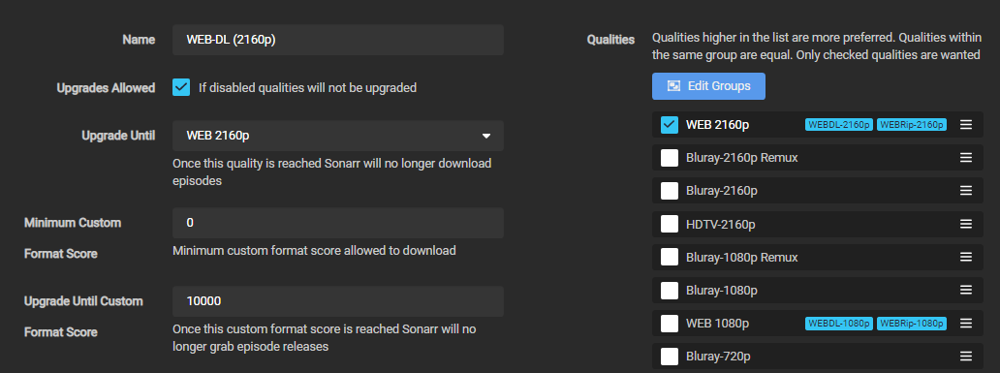

# Comment configurer ses Profiles

!!! note "Ce guide a été créé et est maintenu par [Someone said "Nice"?](https://github.com/NiceTSY)"

Quelle est la meilleure façon de configurer les Formats Personnalisés (ou Custom Formats) et lesquels utiliser avec quel score pour obtenir une release avec un audio français et un anglais ?

Gardez à l'esprit que la plupart des releases sont MULTi (comprenez double audio, original et français) et qu'il sera difficile d'avoir uniquement l'audio français, à moins que vous ne soyez prêt à obtenir du 720p, ou que vous ne recherchiez que des séries françaises.

Pour ce qui est de la qualité, il n'y a pas de recette miracle, cela dépend de votre installation (périphériques) et de vos préférences personnelles.

Certains préfèrent une qualité audio élevée (HD Audio), d'autres une meilleure qualité vidéo. Nombreux sont ceux qui préfèrent les deux.

TRaSH a créé un [schéma](/Sonarr/sonarr-setup-custom-formats/#which-quality-profile-should-you-choose){:target="_blank" rel="noopener noreferrer"} pour faciliter votre décision/choix. Notez que ce graphique n'inclut aucun des Formats Personnalisés de ce guide et que vous devrez quand même le lire pour obtenir des releases en MULTi.

------

## Notions de base

Il est impératif que vous respectiez et compreniez ce qui est proposé par le guide de TRaSH (*en anglais uniquement*) :

- L'ajout de Formats Personnalisés, comme expliqué dans [How to import Custom Formats](/Sonarr/sonarr-import-custom-formats/){:target="_blank" rel="noopener noreferrer"}.
- La configuration d'un profil de qualité pour utiliser les formats personnalisés, comme expliqué dans la section [How to setup Quality Profiles | Basics section](/Sonarr/sonarr-setup-quality-profiles/#basics){:target="_blank" rel="noopener noreferrer"}.

------

## Je ne suis intéressé que par des films sous-titrés en français (VOSTFR)

Deux options s'offre à vous :

### En utilisant le guide de TRaSH et Bazarr

!!! tip "Il s'agit de la méthode à privilégier."

- Configurez Radarr en utilisant : [How to setup Quality Profiles | Which Quality Profile should you choose](/Sonarr/sonarr-setup-quality-profiles/#which-quality-profile-should-you-choose){:target="_blank" rel="noopener noreferrer"}. (*en anglais*).
- Configurez [Bazarr](../Bazarr/Setup-Guide.md) (*en anglais*). Il permet d'obtenir des sous-titres pour tous les films.
- Profitez de vos films avec les sous-titres.
- (Facultatif) Ajoutez le Format Personnalisé [{{ sonarr['cf']['french-vostfr']['name'] }}](/Sonarr/sonarr-collection-of-custom-formats/#vostfr){:target="_blank" rel="noopener noreferrer"} avec un score de `{{ sonarr['cf']['french-vostfr']['trash_scores']['french-vostfr'] }}`.

### En utilisant les exemples suivants et le Format Personnalisé VOSTFR

- Continuez sur cette page.
- Ignorez toute mention des **Formats Personnalisés MULTi**.
- Ajoutez le Format Personnalisé [{{ sonarr['cf']['french-vostfr']['name'] }}](/Sonarr/sonarr-collection-of-custom-formats/#vostfr){:target="_blank" rel="noopener noreferrer"} avec un score de `{{ sonarr['cf']['french-vostfr']['trash_scores']['french-vostfr'] }}`.

------

## Usages

Il y a deux façons d'aborder les exemples ci-dessous. En utilisant ou non les Formats Personnalisés de Groupes P2P du Guide original (qui peuvent être trouvés ici : [Collection of Custom Formats](/Sonarr/sonarr-collection-of-custom-formats/){:target="_blank" rel="noopener noreferrer"}).
Afin d'illustrer ce principe, vous verrez une section **"Mix original (optionnel)"** dans chacun des exemples ci-dessous. Vous devez comprendre que si vous ajoutez les Formats Personnalisés de cette section optionnelle, si Radarr ne trouve pas de MULTi, vous aurez toujours un bon score pour l'audio anglais.

!!! warning "Attention"
    Si vous utilisez le **"Mix original (optionnel)"**. Vous devez comprendre que même si l'objectif principal de ces Formats Personnalisés est de travailler en parallèle avec les formats du guide original. Vous pouvez vous retrouver avec un seul audio alors qu'il existe une version MULTi. La raison est que la release n'a pas été notée assez haut pour l'emporter sur les autres scores.

Un exemple pour les Animes en MULTi/VOSTFR est également fourni à la fin : [Exemple pour les Animes](#exemple-pour-les-animes)

------

## Exemples de Profil

--8<-- "includes/cf/score-attention.md"

------

### Type de versions françaises

Ces Formats sont optionnels et ne sont là que pour renommer votre fichier ou pour éviter un certain type de version française. Exemples :

- Vous préférez l'audio VFF (y compris VFI et VF2), dans ce cas vous les placerez à `101` au lieu de `0`.
- Vous souhaitez seulement du VOSTFR, dans ce ce cas, ignorez toute mention des **Formats Personnalisés MULTi** et donnez un score de `{{ sonarr['cf']['french-vostfr']['trash_scores']['french-vostfr'] }}` au Format Personnalisé [{{ sonarr['cf']['french-vostfr']['name'] }}](/Sonarr/sonarr-collection-of-custom-formats/#vostfr).

!!! warning "Attention"
    Il n'est pas vraiment recommandé d'attribuer un score négatif à l'un des Formats Personnalisés de VF (VFF, VFQ, VQ, VFB, VFI, VF2). Augmentez plutôt le score de votre format audio préféré.

{! include-markdown "../../includes/french-guide/sonarr-french-audio-version-fr.md" !}

------

### Services de streaming francophones

Tous ces éléments sont facultatifs et ne sont là qu'à titre d'information et ne sont pas associés à un score. Cela est dû au fait que peu de sorties sont marquées avec ces services, ce qui rend leur évaluation difficile. De plus, les services de streaming couverts par le guide de TRaSH sont souvent de meilleure qualité.

{! include-markdown "../../includes/french-guide/sonarr-french-streaming-services-fr.md" !}

------

### TRaSH recommandations (*en anglais*)

{! include-markdown "../../includes/cf/sonarr-suggest-attention.md" !}

------

#### WEBDL-1080p

Si vous préférez les 720p/1080p WEBDL (WEB-1080p)

{! include-markdown "../../includes/french-guide/sonarr-french-multi-audio-fr.md" !}

{! include-markdown "../../includes/french-guide/sonarr-french-unwanted-fr.md" !}

{! include-markdown "../../includes/cf/sonarr-misc.md" !}

{! include-markdown "../../includes/cf/sonarr-streaming-services.md" !}

{! include-markdown "../../includes/french-guide/sonarr-cf-french-web-scoring-fr.md" !}

Les Formats Personnalisés `Audio Advanced` ne sont pas inclus dans le profil WEB, car vous trouverez difficilement de l'audio HD avec des WEBDL (seuls les nouveaux WEBDL auront de l'Atmos). Si vous voulez aussi de l'audio HD, vous devriez opter pour les Remuxes.

Utilisez les paramètres principaux suivants dans votre profil.

!!! info ""

    Pour certaines émissions plus anciennes, vous pourriez avoir besoin d'activer le `WEB 720p` ou même le `HDTV 1080p`.

{! include-markdown "../../includes/starr/move-quality-to-top.md" !}

??? abstract "Logique et fonctionnement - [Cliquer pour afficher/masquer]"

    **En fonction de ce qui est disponible en premier, la logique sera la suivante :**

    - Il téléchargera le WEB-DL 1080p (si vous avez également activé `WEB 720p` et/ou `HDTV 1080p`, la mise à niveau se fera jusqu'au WEB-DL 1080p).
    - Le média sera mis à niveau en fonction des formats personnalisés ajoutés jusqu'à l'obtention d'un score de `10000`.

------

#### WEBDL-2160p

Si vous préférez les 2160p WEBDL (WEB-2160p)

Le seul problème avec le 2160p réside dans le fait de l'obtenir avec le DV/HDR, le 2160p sans DV/HDR ne représente qu'un bénéfice minime.

{! include-markdown "../../includes/cf/sonarr-all-hdr-formats.md" !}

{! include-markdown "../../includes/french-guide/sonarr-french-multi-audio-fr.md" !}

{! include-markdown "../../includes/french-guide/sonarr-french-unwanted-uhd-fr.md" !}

{! include-markdown "../../includes/cf/sonarr-optional-uhd.md" !}

{! include-markdown "../../includes/cf/sonarr-misc.md" !}

{! include-markdown "../../includes/cf/sonarr-uhd-streaming-services.md" !}

{! include-markdown "../../includes/french-guide/sonarr-cf-french-web-scoring-fr.md" !}

Utilisez les paramètres principaux suivants dans votre profil.

!!! info ""

    La raison pour laquelle le WEB 1080p est fusionné avec le 2160p est que certaines sorties NF ne seront pas publiées en 4k, mais possède tout de même du DV/HDR.
    Si vous voulez faire la même chose, veillez à remplacer [x265 (HD)](/Sonarr/sonarr-collection-of-custom-formats/#x265-hd){:target="_blank" rel="noopener noreferrer"} par [x265 (no HDR/DV)](/Sonarr/sonarr-collection-of-custom-formats/#x265-no-hdrdv){:target="_blank" rel="noopener noreferrer"}.

??? abstract "Logique et fonctionnement - [Cliquer pour afficher/masquer]"

    **En fonction de ce qui est disponible en premier, la logique sera la suivante :**

    - Il téléchargera le WEB-DL 1080p si il possède un layer DV/HDR.
    - Il sera mis à niveau vers le WEB-2160p lorsqu'il sera disponible.
    - Le média sera mis à niveau en fonction des formats personnalisés ajoutés jusqu'à l'obtention d'un score de `10000`.

------

#### Exemple pour les Animes

Si vous cherchez des animes avec des sous-titres français ou en MULTi (audio original + français).

{! include-markdown "../../includes/french-guide/sonarr-french-anime-info-fr.md" !}

{! include-markdown "../../includes/french-guide/sonarr-french-multi-audio-fr.md" !}

{! include-markdown "../../includes/french-guide/sonarr-french-unwanted-uhd-fr.md" !}

{! include-markdown "../../includes/french-guide/sonarr-french-streaming-services-anime-fr.md" !}

{! include-markdown "../../includes/french-guide/sonarr-cf-french-anime-scoring-fr.md" !}

------

### Formats HDR

TRaSH fournit d'excellents guides et explications à leur sujet dans les liens suivants (*en anglais uniquement*) :

- [HDR Formats](/Sonarr/sonarr-setup-quality-profiles/#hdr-formats){:target="_blank" rel="noopener noreferrer"}

------

## FAQ & INFO

Une FAQ répondant à la plupart des questions que vous pourriez vous poser est fournie par TRaSH (*en anglais uniquement*) : [FAQ & Info](/Sonarr/sonarr-setup-quality-profiles/#faq-info){:target="_blank" rel="noopener noreferrer"}

------

## Remerciements

- Un grand merci à toutes les personnes qui m'ont aidé à tester ces Profils et Formats (et qui continuent à le faire).
- Une mention spéciale à MySuperChef, PrL et KoUiGnAmAnN pour leur temps et leurs explications.
- Une mention spéciale à SeiyaGame, TheFrenchNaruto et Maxence qui ont fourni toutes les informations concernant les animes.
- Une mention spéciale pour Piou et Wikoul qui sont potentiellement tous les deux maintenant dans des asiles en raison de la quantité de tests effectués.
- [TRaSH](https://trash-guides.info/), pour m'avoir accordé un petit espace sur son guide, ses connaissances, et sa gentillesse.

--8<-- "includes/support.md"
