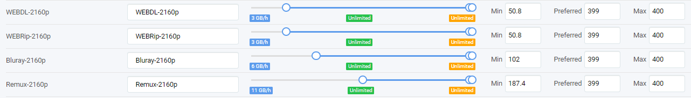

#### Custom Formats and scores

{! include-markdown "../../includes/cf/audio.md" !}
<!-- --8<-- "includes/cf/audio.md" -->

{! include-markdown "../../includes/cf/hdr-metadata.md" !}
<!-- --8<-- "includes/cf/hdr-metadata.md" -->

{! include-markdown "../../includes/cf/movie-versions-imaxe.md" !}
<!-- --8<-- "includes/cf/movie-versions-imaxe.md" -->

??? summary "HQ Source Groups - [CLICK TO EXPAND]"
    | Custom Format                           | Score                                          | LINK                                                                                                                                                                                  |
    | --------------------------------------- | ---------------------------------------------- | ------------------------------------------------------------------------------------------------------------------------------------------------------------------------------------- |
    | {{ radarr['hq-remux']['name'] }}        | {{ radarr['hq-remux']['trash_score'] }}        | [:octicons-link-external-16:](/Radarr/Radarr-collection-of-custom-formats/#hq-remux){: .header-icons target=_blank rel="noopener noreferrer" }                                        |
    | {{ radarr['flights-no-imax']['name'] }} | {{ radarr['flights-no-imax']['trash_score'] }} | [:octicons-link-external-16:](https://raw.githubusercontent.com/TRaSH-/Guides/master/docs/json/radarr/flights-no-imax.json){: .header-icons target=_blank rel="noopener noreferrer" } |
    | {{ radarr['hq-webdl']['name'] }}        | {{ radarr['hq-webdl']['trash_score'] }}        | [:octicons-link-external-16:](/Radarr/Radarr-collection-of-custom-formats/#hq-webdl){: .header-icons target=_blank rel="noopener noreferrer" }                                        |
    | {{ radarr['hq']['name'] }}              | 0                                              | [:octicons-link-external-16:](/Radarr/Radarr-collection-of-custom-formats/#hq){: .header-icons target=_blank rel="noopener noreferrer" }                                              |

{! include-markdown "../../includes/cf/hq4k.md" !}
<!-- --8<-- "includes/cf/hq4k.md" -->

{! include-markdown "../../includes/cf/misc.md" !}
<!-- --8<-- "includes/cf/misc.md" -->

{! include-markdown "../../includes/cf/unwanted.md" !}
<!-- --8<-- "includes/cf/unwanted.md" -->

### Quality Size

`Settings` => `Quality`

| Quality      | Min   | Preferred | Max |
| ------------ | ----- | --------- | --- |
| WEBDL-2160p  | 50.8  | 399       | 400 |
| WEBRip-2160p | 50.8  | 399       | 400 |
| Bluray-2160p | 102   | 399       | 400 |
| Remux-2160p  | 187.4 | 399       | 400 |

??? check "example - [CLICK TO EXPAND]"
    

    !!! attention
        These screenshots are just examples to show you how it should look and where you need to place the data that you need to add, they aren't always a 100% reflection of the actual data and not always 100% up to date with the actual data you need to add.

        - Always follow the data described in the guide.
        - If you got any questions or aren't sure just click the chat badge to join the Discord Channel where you can ask your questions directly.
