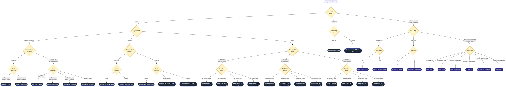

<!-- markdownlint-disable MD041-->

```mermaid
%%{init: {"flowchart": {"useMaxWidth": false, "htmlLabels": true, "curve": "basis"}, "themeVariables": {"fontSize": "14px"}}}%%
flowchart TD
    START([Start: pick a Radarr profile]) --> KIND{What kind of<br/>content?}
    KIND -->|Movies| MAIN_LANG{Primary audio<br/>language?}
    KIND -->|Anime movies| ANIME_LANG{Anime audio<br/>language?}
    KIND -->|Power user /<br/>custom SQP rules| SQP_RES{SQP - target<br/>resolution?}

    MAIN_LANG -->|English / international| EN_RES{Display + player<br/>resolution?}
    MAIN_LANG -->|German| DE_RES{Display + player<br/>resolution?}
    MAIN_LANG -->|French| FR_VAR{French audio<br/>variant?}

    EN_RES -->|1080p only| EN_HD_SRC{Source<br/>preference?}
    EN_HD_SRC -->|Encode<br/>smaller / cheaper| P_HD([HD Bluray + WEB])
    EN_HD_SRC -->|Remux<br/>untouched stream| P_R1080([Remux + WEB 1080p])

    EN_RES -->|2160p / 4K<br/>HDR-capable player| EN_UHD_SRC{Source<br/>preference?}
    EN_UHD_SRC -->|Encode<br/>x265 acceptable| P_UHD([UHD Bluray + WEB])
    EN_UHD_SRC -->|Remux<br/>maximum quality| P_R2160([Remux + WEB 2160p])
    EN_UHD_SRC -->|Combined<br/>Remux + WEB tiers| P_R2160_COMB([Remux 2160p Combined])
    EN_UHD_SRC -->|Alternative scoring| P_R2160_ALT([Remux 2160p Alternative])

    DE_RES -->|1080p only| DE_HD_SRC{Source<br/>preference?}
    DE_HD_SRC -->|Encode| P_DE_HD(["[German] HD Bluray + WEB"])
    DE_HD_SRC -->|Remux| P_DE_HDR(["[German] HD Remux + WEB"])
    DE_RES -->|2160p / 4K| DE_UHD_SRC{Source<br/>preference?}
    DE_UHD_SRC -->|Encode| P_DE_UHD(["[German] UHD Bluray + WEB"])
    DE_UHD_SRC -->|Encode alternative| P_DE_UHD_ALT(["[German] UHD Bluray + WEB Alt"])
    DE_UHD_SRC -->|Remux| P_DE_UHDR(["[German] Remux + WEB 2160p"])

    FR_VAR -->|MULTi.VO<br/>original + French| FR_VO_RES{Resolution +<br/>source?}
    FR_VAR -->|MULTi.VF<br/>French audio only| FR_VF_RES{Resolution +<br/>source?}
    FR_VAR -->|VOSTFR<br/>French subtitles| FR_VOSTFR_RES{Resolution +<br/>source?}

    FR_VO_RES -->|HD Bluray + WEB| P_FR_VO_HD(["[French MULTi.VO]<br/>HD Bluray + WEB"])
    FR_VO_RES -->|HD Remux 1080p| P_FR_VO_HDR(["[French MULTi.VO]<br/>HD Remux (1080p)"])
    FR_VO_RES -->|UHD Bluray + WEB| P_FR_VO_UHD(["[French MULTi.VO]<br/>UHD Bluray + WEB"])
    FR_VO_RES -->|UHD Remux 2160p| P_FR_VO_UHDR(["[French MULTi.VO]<br/>UHD Remux (2160p)"])

    FR_VF_RES -->|HD Bluray + WEB| P_FR_VF_HD(["[French MULTi.VF]<br/>HD Bluray + WEB"])
    FR_VF_RES -->|HD Remux 1080p| P_FR_VF_HDR(["[French MULTi.VF]<br/>HD Remux (1080p)"])
    FR_VF_RES -->|UHD Bluray + WEB| P_FR_VF_UHD(["[French MULTi.VF]<br/>UHD Bluray + WEB"])
    FR_VF_RES -->|UHD Remux 2160p| P_FR_VF_UHDR(["[French MULTi.VF]<br/>UHD Remux (2160p)"])

    FR_VOSTFR_RES -->|HD Bluray + WEB| P_FR_VOS_HD(["[French VOSTFR]<br/>HD Bluray + WEB"])
    FR_VOSTFR_RES -->|HD Remux 1080p| P_FR_VOS_HDR(["[French VOSTFR]<br/>HD Remux (1080p)"])
    FR_VOSTFR_RES -->|UHD Bluray + WEB| P_FR_VOS_UHD(["[French VOSTFR]<br/>UHD Bluray + WEB"])
    FR_VOSTFR_RES -->|UHD Remux 2160p| P_FR_VOS_UHDR(["[French VOSTFR]<br/>UHD Remux (2160p)"])

    ANIME_LANG -->|EN / JP| P_ANIME(["[Anime] Remux-1080p"])
    ANIME_LANG -->|German| P_DE_ANIME(["[German] Anime HD Bluray + WEB"])

    SQP_RES -->|1080p only| SQP_1080_WEB{WEB-only?}
    SQP_1080_WEB -->|No| P_SQP_1_1080(["[SQP] SQP-1 (1080p)"])
    SQP_1080_WEB -->|Yes| P_SQP_1_W1080(["[SQP] SQP-1 WEB (1080p)"])
    SQP_RES -->|2160p only| SQP_2160_WEB{WEB-only?}
    SQP_2160_WEB -->|No| P_SQP_1_2160(["[SQP] SQP-1 (2160p)"])
    SQP_2160_WEB -->|Yes| P_SQP_1_W2160(["[SQP] SQP-1 WEB (2160p)"])
    SQP_RES -->|Tiered multi-profile setup<br/>see SQP guide| SQP_TIER{Which tier?}
    SQP_TIER -->|Strict block-list| P_SQP_2(["[SQP] SQP-2"])
    SQP_TIER -->|Streaming-focused| P_SQP_3(["[SQP] SQP-3"])
    SQP_TIER -->|Streaming + audio priority| P_SQP_3A(["[SQP] SQP-3 (Audio)"])
    SQP_TIER -->|Encodes + Remux hybrid| P_SQP_4(["[SQP] SQP-4"])
    SQP_TIER -->|MA-hybrid Remux variant| P_SQP_4M(["[SQP] SQP-4 (MA Hybrid)"])
    SQP_TIER -->|Hardlinked-store optimised| P_SQP_5(["[SQP] SQP-5"])

    classDef leaf fill:#1f2937,stroke:#4051B5,stroke-width:2px,color:#fff,font-weight:bold;
    classDef decision fill:#fef3c7,stroke:#ca8a04,color:#000;
    classDef sqp fill:#312e81,stroke:#a5b4fc,color:#fff;
    class P_HD,P_R1080,P_UHD,P_R2160,P_R2160_COMB,P_R2160_ALT,P_DE_HD,P_DE_HDR,P_DE_UHD,P_DE_UHD_ALT,P_DE_UHDR,P_FR_VO_HD,P_FR_VO_HDR,P_FR_VO_UHD,P_FR_VO_UHDR,P_FR_VF_HD,P_FR_VF_HDR,P_FR_VF_UHD,P_FR_VF_UHDR,P_FR_VOS_HD,P_FR_VOS_HDR,P_FR_VOS_UHD,P_FR_VOS_UHDR,P_ANIME,P_DE_ANIME leaf;
    class P_SQP_1_1080,P_SQP_1_W1080,P_SQP_1_2160,P_SQP_1_W2160,P_SQP_2,P_SQP_3,P_SQP_3A,P_SQP_4,P_SQP_4M,P_SQP_5 sqp;
    class KIND,MAIN_LANG,ANIME_LANG,EN_RES,EN_HD_SRC,EN_UHD_SRC,DE_RES,DE_HD_SRC,DE_UHD_SRC,FR_VAR,FR_VO_RES,FR_VF_RES,FR_VOSTFR_RES,SQP_RES,SQP_1080_WEB,SQP_2160_WEB,SQP_TIER decision;
```
<!-- markdownlint-enable MD041-->
